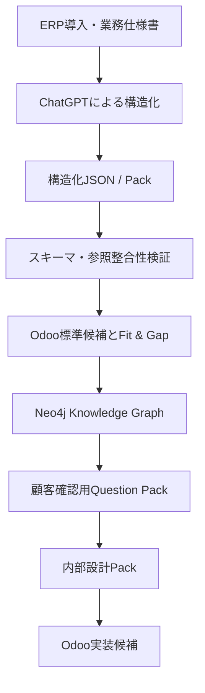
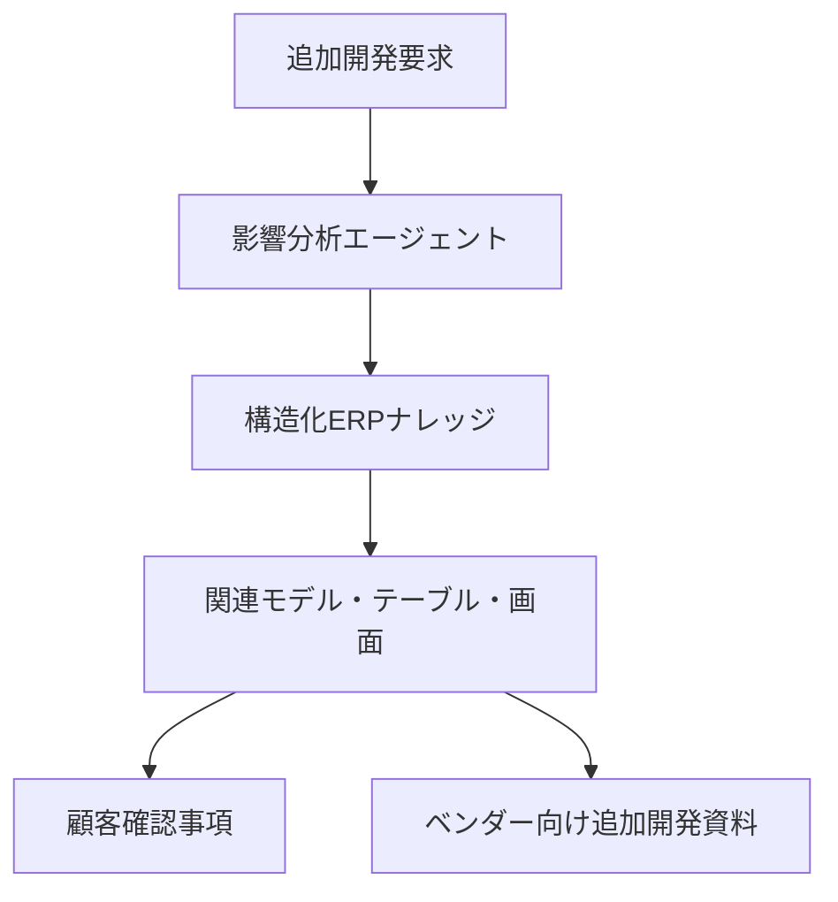

# Architecture

## 全体像

ChatGPTは資料の意味解釈と構造化候補の生成を担当します。実行環境はLLMを直接呼び出さず、入力された構造化データを決定論的に検証・変換します。

## 主な処理境界

### 1. 資料読解

- 元資料をChatGPTへ提示
- 目的別プロンプトで業務要件を抽出
- 定義済み形式のJSON／Packとして出力

APIを組み込まなかった理由は、PoC段階の繰り返し処理コストを避け、構造とプロンプトの妥当性を先に検証するためです。

### 2. 検証

- 必須構造の検査
- ノード・リレーション参照の検査
- dangling relationshipの検出
- 未確認事項を自動補完せず、確認対象として保持

### 3. Fit & Gap

- Odoo標準機能で扱える候補
- 標準設定で扱う候補
- 非破壊的なオーバーレイ候補
- 追加開発または確認が必要なGAP

GAPを推測で自動実装しないことをガードレールとしています。

### 4. Knowledge Graph

業務テーマ、Odooモデル、項目、実装候補などの関係をNeo4jへ投影します。書込み前にdry-runと参照整合性確認を行います。

### 5. 人間の意思決定

顧客確認用Question Packと内部設計Packを分離し、未確認の顧客回答を自動入力しません。

### 6. Odooへの接続

確認済みの構造データから、Odooアドオン生成用の材料を作成します。PoCでは標準モデルを破壊しない追加項目と支援マスタを中心に検証しました。

## 将来のエージェント構想

このエージェント構想は未完成です。本PoCは、そのために必要となる構造化データと検証方法を扱っています。
