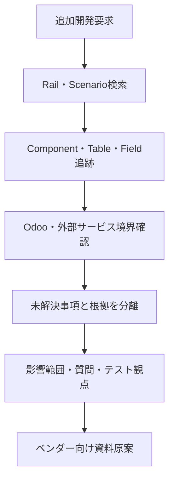

# Accounting Knowledge Dataset

## データ成果の位置づけ

会計領域のテーブル定義、業務フロー、一般会計、売掛金、買掛金、外部インターフェースなどの資料を段階的に読み取り、検索・検証可能な正規化データへ統合した成果です。

このデータは完成したOdoo移行データではありません。追加開発要求を受けたエージェントが、関連するテーブル、フィールド、業務シナリオ、機能、システム境界、根拠資料を検索し、影響範囲と確認事項を集めるためのKnowledge Datasetとして構想しました。

## 実データの集計

| データ種別 | 件数 |
|---|---:|
| テーブル定義 | 170 |
| フィールド | 6,804 |
| テーブルプロパティ | 7,650 |
| インデックス | 340 |
| テーブル間リレーション | 1,499 |
| フィールドグループ | 954 |
| Business Rail | 28 |
| 業務シナリオ | 342 |
| 機能コンポーネント | 97 |
| 検証済みリンク | 297 |
| Odoo Base判定 | 637 |
| 会計サービス境界判定 | 637 |
| 日本会計テンプレート判定 | 637 |
| 最終整合性チェック | 17 |

元の統合成果は15段階・約52.8MBで、状態は`export_complete`です。

## データの構成

単純なテーブル定義一覧ではなく、次のデータをキーで接続しています。

- Canonical Table Dictionary
  - テーブル、フィールド、プロパティ、インデックス、リレーション、フィールドグループ
- Canonical Business Rails
  - 会計処理を横断する業務の流れ
- Canonical Business Scenarios
  - 起点、担当者、前提条件、処理手順、例外、期待結果
- Functional Components
  - 画面、照会、バッチ、帳票、外部連携などの機能単位
- Validated Links
  - Table、Component、Scenario、Rail間の関係と根拠、信頼度
- Implementation Boundary
  - Odoo標準、Odoo追加開発、外部会計サービス、参照のみ、未解決の判定
- Japan Accounting Template
  - 日本標準、一般的商慣行、業界共通、個別実装物の分類

## 想定していたエージェント検索

追加開発要求を自然文で受けたとき、エージェントが次の順で必要情報を集める構想でした。

1. 要求文から業務目的、対象機能、データ、例外条件を抽出する。
2. 関連するBusiness RailとScenarioを検索する。
3. Scenarioに接続されたComponent、Table、Field、Relationをたどる。
4. Odoo標準、追加開発、外部サービスの責務境界を確認する。
5. 根拠が弱いリンク、未解決項目、顧客確認が必要な事項を分離する。
6. 影響範囲、質問事項、実装候補、データ移行、インターフェース、テスト観点をまとめる。
7. 開発ベンダーへ渡す追加開発資料の原案を生成する。

## 現在の到達点

資料の段階的抽出、正規化、統合、リンク検証、実装境界の候補判定、整合性チェックまでを実施しました。RAGインデックス、検索エージェント、ベンダー向け仕様書の全自動生成は、この成果を基礎データとして後続開発する構想であり、このPoCでは完成していません。

## 公開範囲

原本には旧システム固有のテーブル名、資料名、会計業務の詳細な対応関係が含まれるため公開していません。

[匿名化データサンプル](data/accounting_knowledge_sample.json)では、実データの検索単位、キー設計、関係構造を維持しながら、企業固有名称と原資料名を一般化しています。
