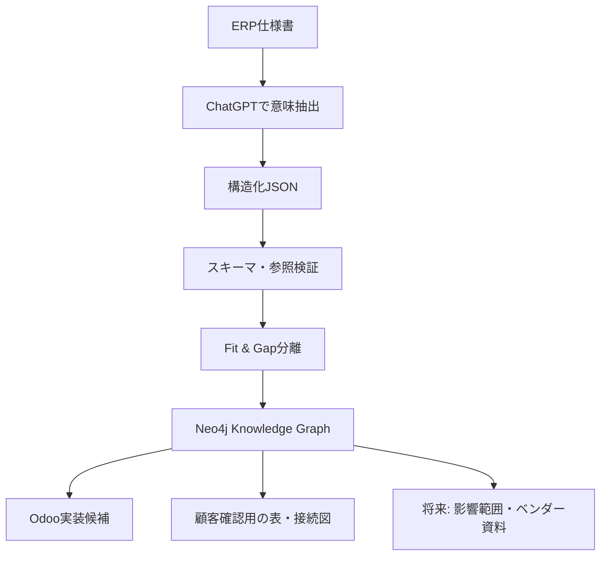

# Sanitized Execution Showcase

このディレクトリは、PoCが実際に何を処理し、どこまで到達したかを示すための匿名化された実行成果です。

## 読む順番

1. `01_p1_structuring_report.md` — ERP仕様からOdoo標準置換候補を構造化
2. `02_fit_gap_report.md` — 自動確定できない要件を検出し、安全に除外
3. `03_knowledge_graph_report.md` — モデル、要件、シナリオの関係をNeo4j用グラフへ変換
4. `04_odoo_addon_mapping_report.md` — 確定候補だけを非破壊的なOdooオーバーレイ候補へ変換
5. `05_customer_confirmation_materials.md` — 構造化データから顧客確認用の表・接続図を生成
6. `pipeline_snapshot.json` — 各段階の実行集計

## 何を実証したか

- 確率的なLLMの読解結果を、そのまま実装へ流さず、決定論的な検証処理へ渡せること
- 6業務領域を横断して、モデル・設定・業務シナリオ間の参照をグラフ化できること
- 解決できない参照を黙って補完せず、Fit & Gapとして隔離できること
- Odoo標準モデルを書き換えず、レビュー可能なオーバーレイ候補へ変換できること
- 同じ構造化データから、非エンジニアも確認できるテーブル一覧・フィールド一覧・接続図を生成できること

## 匿名化方針

元の実行成果は641ファイル、約160MBでした。公開版には次を含めていません。

- 元企業名、個人名、組織、役職、権限、承認経路
- 元資料、顧客回答、実データ、内部UUID
- アップロードZIP、バックアップ、重複実行履歴
- 生成アドオン中の企業固有マスタ・取引先データ

公開した集計値と処理段階は実行成果に基づきますが、例示用のキーは一般化しています。
